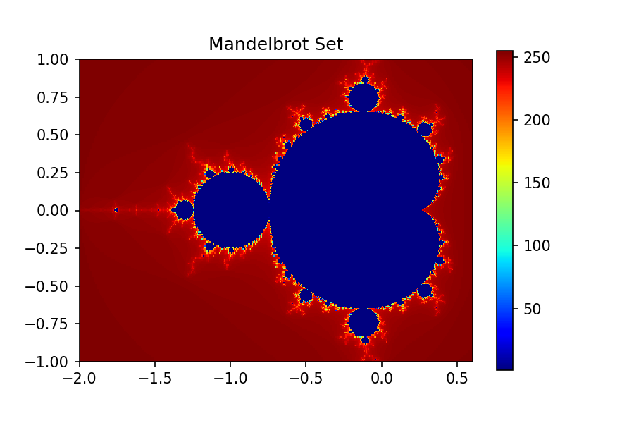
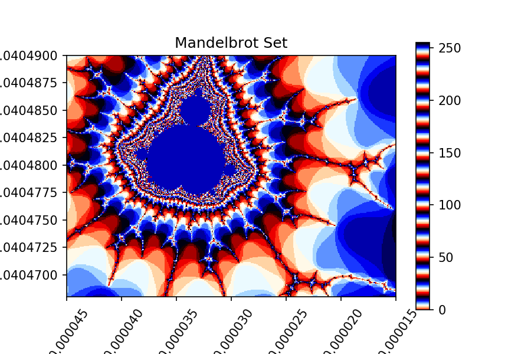
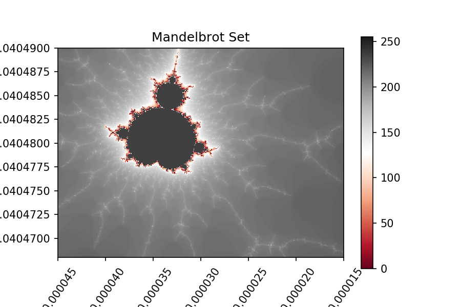
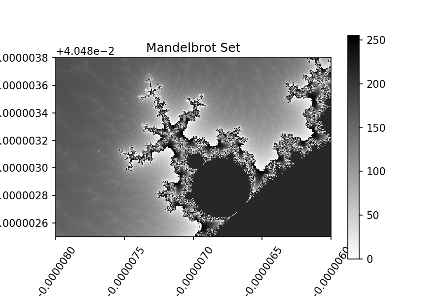

# Mandelbrot

See it rendered live using WebGL Shader Library on https://omerkel.github.io/Fractals/Mandelbrot/Shader_Library

From Jupyter Notebook _[Mandelbrot Set.ipynb](Mandelbrot%20Set.ipynb)_ :

<table>
  <tr><td>  </td>
    <td>  </td></tr>
  <tr><td>  </td>
    <td>  </td></tr>
</table>

From Jupyter Notebook _[Render a Mandelbrot Set.ipynb](Render%20a%20Mandelbrot%20Set.ipynb)_ :

Rendered with _mandelbrot_ascii.py_ :

