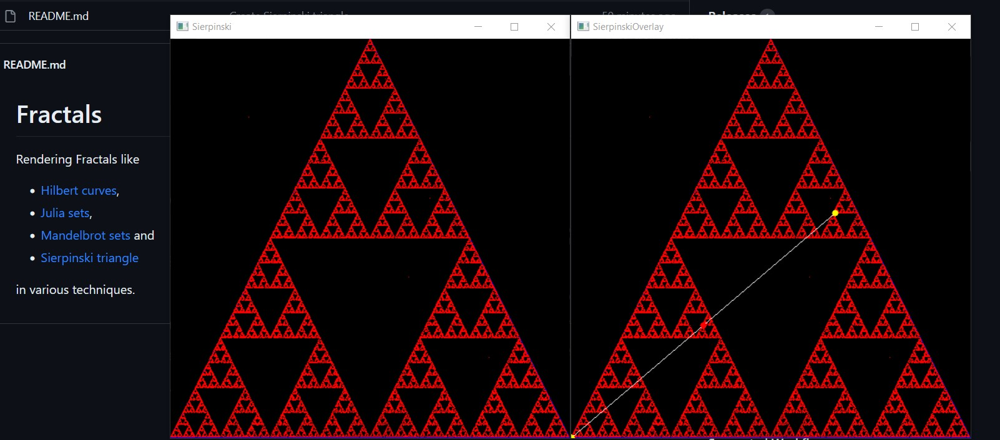

How to Run the Code
===================

1. Create a Python virtual environment
1. Activate the virtual environment
1. Install required Python modules (if installation time out occurs then increase the time out setting on slow connections)
1. Run the Sierpinski triangle generator

```
python -m venv venv
venv\Scripts\activate
python -m pip install --upgrade pip --timeout 1000
pip install -r requirements.txt --timeout 1000
python sierpinski.py
```

* Pressing ESC exits the running program
* Pressing SPACE iterates through the generation step by step.
    * In the SierpinskiOverlay window an additional line is drawn between the current cursor position and one of the randomly selected triangle corners. In the next iteration the cursor position is set to the middle of that line (... randomly selecting one of the triangle corners again, etc.).


