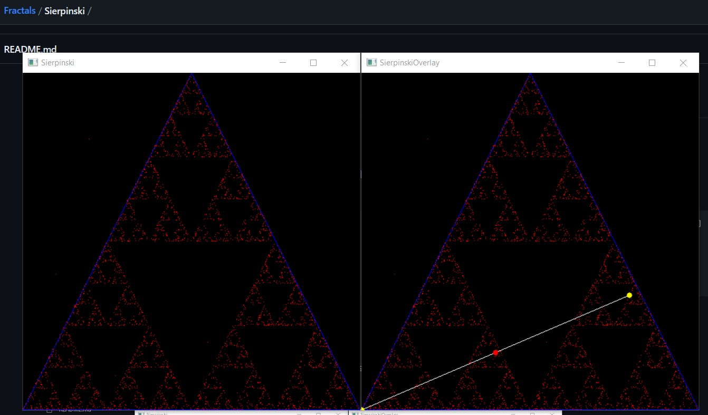
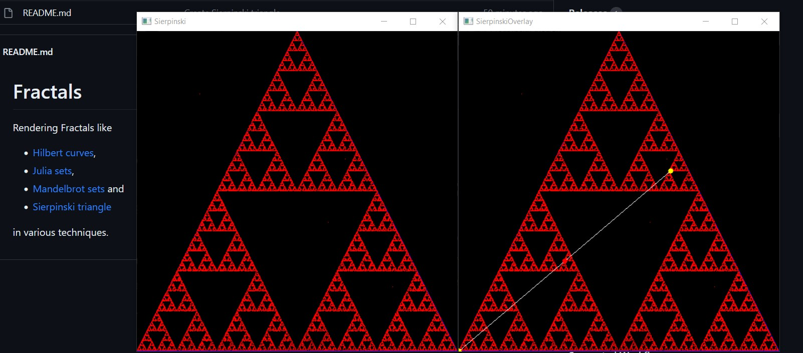
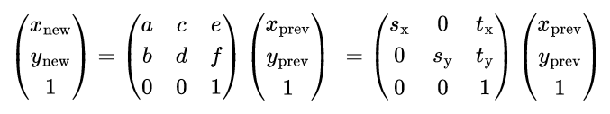

How to Run the Code
===================

The Python version creates the Sierpinski triangle on some randomness. Over lots of iterations it jumps to coordinate positions and density of points are higher close to attractors while space in between remains empty. Just the first few iterations break that behaviour a bit.

In contrast the SVG version is cleanly constructing the Sierpinski triangle by a copying mechanism. This is performed more as an IFS (Iterated Function System). Due to that mechanism the resulting fractal is obviously showing self-similarity.

Python Version
--------------

1. Create a Python virtual environment
1. Activate the virtual environment
1. Install required Python modules (if installation time out occurs then increase the time out setting on slow connections)
1. Run the Sierpinski triangle generator

```
cd Python
python -m venv venv
venv\Scripts\activate
python -m pip install --upgrade pip --timeout 1000
pip install -r requirements.txt --timeout 1000
python sierpinski.py
```

* Pressing ESC exits the running program
* Pressing SPACE iterates through the generation step by step.
    * In the SierpinskiOverlay window an additional line is drawn between the current cursor position and one of the randomly selected triangle corners. In the next iteration the cursor position is set to the middle of that line (... randomly selecting one of the triangle corners again, etc.).



After lots of iterations:



SVG Version
-----------

Simply open the <em>sierpinski.svg</em> in a graphical webbrowser of your choice or a graphics tool supporting Scalable Vector Graphics (SVG) like [Inkscape](https://inkscape.org/).

The last few lines in <em>sierpinski.svg</em> contain a &lt;use&gt; element with id _iterationdepth_. The according attribute _l:href_ of this element simply controls the iteration depth. You can vary the value of the attribute to link in range _iteration0_ up to _iteration10_.

```
  </defs>
  <g>
    <use id="iterationdepth" l:href="#iteration10"/>
  </g>
</svg>
```

The construction rule looks as follows: Per iteration the previous iteration's image is reduced by size (scaling it to 50%) and setting three copies of itself in each of the corner positions of the previous triangle.

```
    <g id="iteration0">
      <path d='m0,0h1l-0.5,-0.86 z' />
    </g>
    <g id="iteration1">
      <use l:href="#iteration0" transform="matrix( .5 0 0 .5 0 0 )"/>
      <use l:href="#iteration0" transform="matrix( .5 0 0 .5 .5 0 )"/>
      <use l:href="#iteration0" transform="matrix( .5 0 0 .5 .25 -.43 )"/>
    </g>
```

Some item is displayed in id _iteration0_. Here I use a path drawing a triangle of side length one. But it could actually be any similar sized object. Since each iteration reduce the size by half that is why the object is anyway reduced to a point on higher iterations.

Each higher iteration points or uses the lower one ( _l:href="#iteration0"_ ) and transform it by scaling and translating it.

The six values of the transform matrix( a b c d e f ) correspond to the coordinate matrix multiplication as follows:



&#8230; where _s_ are scaling factors (all set to 50%) and _t_ are translation sizes (different for each of the three _use_ elements).
